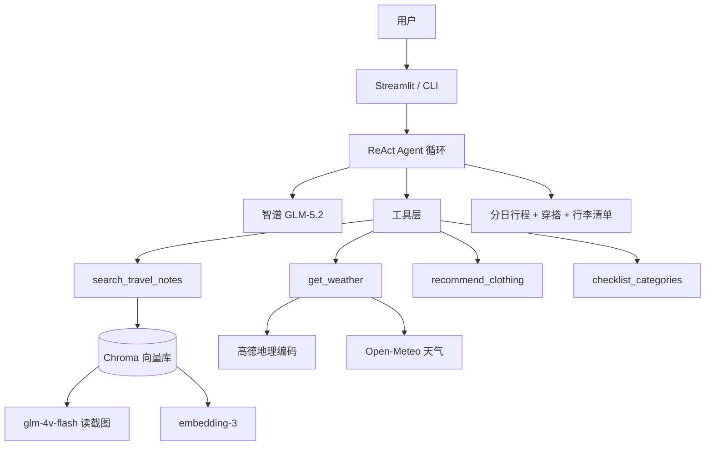

# Travel-Agent-Planner

> 基于 **RAG + 自研 ReAct Agent** 的智能旅行规划系统：支持小红书/抖音攻略截图入库检索，联动实时天气、穿搭与行李工具，一键生成分日行程方案。

[Python](https://www.python.org/)
[LangChain](https://www.langchain.com/)
[Streamlit](https://streamlit.io/)
[License](LICENSE)

---

## ✨ 功能亮点


| 模块              | 能力                                  |
| --------------- | ----------------------------------- |
| **多模态 RAG**     | 小红书/抖音截图 → Vision 结构化 → Chroma 向量检索 |
| **ReAct Agent** | 自研「思考 → 工具调用 → 观测反馈」推理闭环            |
| **实时工具**        | Open-Meteo 天气 + 高德地理编码 + 穿搭/行李建议    |
| **双端交互**        | Streamlit Web 可视化 + CLI 命令行调试       |
| **可解释输出**       | 展示 Agent 推理链路与 RAG 参考来源             |


---

## 🖼 效果预览


> 截图展示：笔记入库（Chroma）· Agent 推理链路（ReAct）· 分日行程与 RAG 来源引用


---

## 🏗 系统架构




---

## 🛠 技术栈

- **语言**：Python 3.10+
- **Agent**：自研 ReAct（非 LangChain 内置 Agent）
- **LLM**：智谱 GLM-5.2（规划推理）
- **Vision**：glm-4v-flash（截图结构化）
- **Embedding**：智谱 embedding-3
- **向量库**：Chroma
- **框架**：LangChain（消息 / Prompt / 模型调用）
- **前端**：Streamlit
- **外部 API**：Open-Meteo、高德 Web 服务

---

## 📁 项目结构

```
Travel-Agent-Planner/
├── web_demo.py                 # Streamlit 入口（规划 + 截图入库）
├── requirements.txt
├── .env.example
├── scripts/
│   ├── seed_rag.py             # 导入假数据样本
│   ├── search_rag_cli.py       # CLI 检索测试
│   └── ingest_notes.py         # 批量截图入库
├── data/
│   ├── sample_notes/           # Demo 假数据 JSON
│   ├── screenshots/            # 用户截图（按 note_id 分文件夹）
│   └── parsed/                 # Vision 解析缓存
├── chroma_db/                  # 向量库（本地生成，不入库）
└── src/
    ├── llm_client.py             # 智谱文本 LLM 封装
    ├── main_cli.py               # 命令行入口
    ├── agent/
    │   ├── agent_core.py         # ReAct 主循环
    │   ├── parser.py             # action 标签解析
    │   └── prompts.py            # 系统 Prompt
    ├── tools/
    │   ├── tool_manager.py       # 工具统一调度
    │   ├── note_search_tool.py   # RAG 检索工具
    │   ├── weather_api.py        # 天气 API
    │   ├── amap_api.py           # 高德地理编码
    │   └── travel_tool.py        # 穿搭 / 行李工具
    └── rag/
        ├── vision_parser.py      # 截图 → 结构化 JSON
        ├── embedder.py           # embedding-3 封装
        ├── vectorstore.py        # Chroma 增删查
        ├── chunker.py            # 笔记切块
        ├── ingest_pipeline.py    # 入库流水线
        └── config.py             # RAG 配置
```

---

## 🚀 快速开始

### 1. 克隆项目

```bash
git clone https://github.com/hezi339/Travel-Agent-Planner.git
cd Travel-Agent-Planner
```

### 2. 创建虚拟环境（推荐）

```bash
python -m venv venv

# Windows
venv\Scripts\activate

# macOS / Linux
source venv/bin/activate
```

### 3. 安装依赖

```bash
pip install -r requirements.txt
```

### 4. 配置环境变量

```bash
# Windows
copy .env.example .env

# macOS / Linux
cp .env.example .env
```

编辑 `.env`，至少填入：


| 变量              | 获取方式                                          |
| --------------- | --------------------------------------------- |
| `ZHIPU_API_KEY` | [智谱开放平台](https://open.bigmodel.cn)            |
| `GAODE_KEY`     | [高德开放平台](https://console.amap.com/)（Web 服务类型） |


### 5. 导入假数据并测试检索

```bash
python scripts/seed_rag.py
python scripts/search_rag_cli.py "广州 3天 美食" --city 广州
```

### 6. 启动 Web Demo

```bash
streamlit run web_demo.py
```

浏览器访问 `http://localhost:8501`

---

## 📖 使用指南

### Agent 旅行规划

在输入框中提问，例如：

```text
根据我收藏的笔记，规划广州3天城市观光，并给穿搭和行李建议
```

Agent 将按需调用工具，左侧可查看完整推理链路，右侧为最终方案。

### 截图笔记入库（RAG）

**方式一：Web 侧边栏**

1. 填写笔记 ID（如 `xhs_guangzhou_001`）
2. 上传小红书/抖音截图
3. 点击「入库到 Chroma」

**方式二：命令行批量入库**

```bash
# 将截图放入 data/screenshots/{note_id}/ 目录后执行
python scripts/ingest_notes.py --force
```

### CLI 模式

```bash
python -m src.main_cli
```

---

## 🔧 Agent 工具列表


| 工具名                    | 参数                    | 说明                |
| ---------------------- | --------------------- | ----------------- |
| `search_travel_notes`  | `query`, `city`（可选）   | 从 Chroma 检索私有旅行笔记 |
| `get_weather`          | `city`, `date`        | 查询指定城市天气（支持「今天」）  |
| `recommend_clothing`   | `weather`, `activity` | 根据天气与活动推荐穿搭       |
| `checklist_categories` | `days`                | 根据天数生成行李分类        |


---

## ⚙️ 环境变量说明


| 变量                           | 默认值            | 说明                                      |
| ---------------------------- | -------------- | --------------------------------------- |
| `ZHIPU_API_KEY`              | —              | 智谱 API Key（LLM + Embedding + Vision 共用） |
| `ZHIPU_MODEL`                | `glm-5.2`      | 文本规划模型                                  |
| `ZHIPU_VISION_MODEL`         | `glm-4v-flash` | 截图解析模型                                  |
| `ZHIPU_EMBEDDING_MODEL`      | `embedding-3`  | 向量化模型                                   |
| `ZHIPU_EMBEDDING_DIMENSIONS` | `1024`         | 向量维度                                    |
| `GAODE_KEY`                  | —              | 高德 Web 服务 Key                           |
| `CHROMA_PERSIST_DIR`         | `./chroma_db`  | Chroma 持久化目录                            |
| `CHROMA_COLLECTION_NAME`     | `travel_notes` | 集合名称                                    |
| `RAG_TOP_K`                  | `3`            | 检索返回条数                                  |


---

## ❓ 常见问题

**检索结果里出现了不相关城市（如查广州却返回成都）？**

向量库默认返回 Top-K 条结果。库内样本较少时，次相关结果也会被带回。解决方式：

```bash
python scripts/search_rag_cli.py "广州 3天 美食" --city 广州
```

或在 Agent 中调用：`search_travel_notes(广州 3天 美食, 广州)`

**提示「向量库为空」？**

先执行假数据导入：

```bash
python scripts/seed_rag.py
```

**天气显示与手机 App 不一致？**

项目使用 Open-Meteo 数据源，与苹果天气等 App 的数据源不同，温度/文案可能存在差异。系统会尽量原样引用工具返回的天气文本，避免 LLM 改写。

**修改代码后页面没变化？**

请完全重启 Streamlit（`Ctrl+C` 后重新 `streamlit run web_demo.py`），必要时清除 `src/**/__pycache__`。

---

## 🔒 安全提示

- **切勿**将 `.env`、`chroma_db/`、用户截图提交到 GitHub
- API Key 泄露后请立即在对应平台轮换
- 截图内容仅供个人学习/demo，请遵守平台版权规范

---

## 🗺 路线图

- 补充 `docs/images/` 演示截图
- 检索相似度阈值过滤
- 高德景点工具接入 Agent
- Docker 一键部署
- Streamlit Cloud 在线 Demo

---

## 📄 License

MIT License — 详见 [LICENSE](LICENSE) 文件。

---

## 🙋 联系

如有问题或建议，欢迎提交 [Issue](https://github.com/hezi339/Travel-Agent-Planner/issues)。