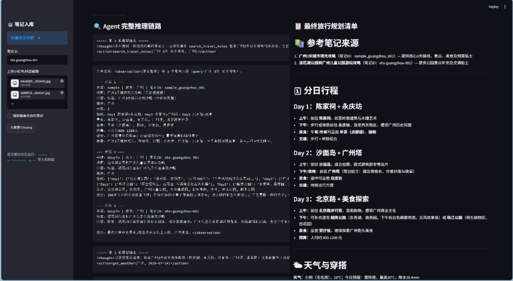
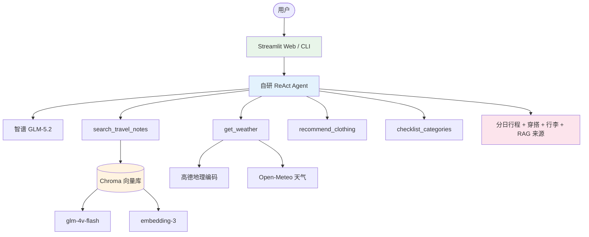
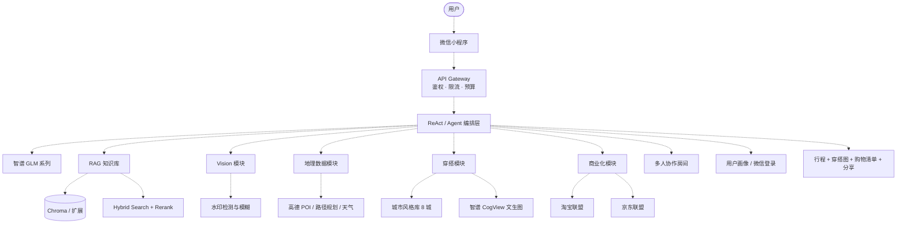

# Travel-Agent-Planner

> **智能旅行穿搭规划助手** — 基于 RAG + 自研 ReAct Agent 的 AI 旅行规划系统  
> 上传小红书/抖音攻略截图，检索私有笔记，联动实时天气与穿搭工具，一键生成分日行程方案。

[](https://www.python.org/)
[](https://www.langchain.com/)
[](https://streamlit.io/)
[](docs/PRD.md)
[](LICENSE)

---

## 📌 项目定位

| 维度 | 说明 |
|------|------|
| **产品文档** | [PRD v1.1《智能旅行穿搭规划助手》](docs/PRD.md)（撰写：贺子谦；完整 Word 版见 `docs/*.docx`） |
| **当前版本** | **Phase 1 技术 Demo**（Streamlit + Python） |
| **验证目标** | 截图 RAG 入库 → Agent 工具链 → 行程/穿搭/行李一体化生成 |
| **完整愿景** | 微信小程序 + AI 穿搭效果图 + 电商导购 + 多人协作（见 [Roadmap](#-产品路线图-roadmap)） |

> ⚠️ **说明**：本仓库 Demo **可运行**的功能见 [✅ 当前已实现](#-当前已实现)；PRD 中的完整产品能力见 [📋 产品能力全景](#-产品能力全景-prd-v11)，已用状态标签区分，避免与 Demo 混淆。

**图例：** ✅ 已实现 · 🚧 部分实现 · 📋 规划中

---

## 🖼 效果预览



> **三栏布局**：左侧笔记入库（Chroma）· 中间 Agent 完整推理链路（ReAct + 工具调用）· 右侧分日行程、天气穿搭与 RAG 参考来源

---

## ✅ 当前已实现

> 以下功能均可在本地运行验证，见 [快速开始](#-快速开始)。

| 能力 | 说明 |
|------|------|
| **多模态 RAG 入库** | 小红书/抖音截图 → glm-4v-flash 结构化 → embedding-3 → Chroma 持久化 |
| **笔记语义检索** | Agent 工具 `search_travel_notes(query, city)`，Top-K 检索 + 城市 metadata 过滤 |
| **自研 ReAct Agent** | 手动实现 `<thought>` / `<action>` / `<observation>` / `<final_answer>` 闭环 |
| **4 类工具调用** | 笔记检索 · 天气 · 穿搭建议 · 行李分类 |
| **实时天气** | 高德地理编码 + Open-Meteo 预报，支持「今天」等自然语言日期 |
| **可解释输出** | Streamlit 展示完整推理链路与 RAG 参考来源 |
| **双端入口** | Streamlit Web（入库 + 规划）+ CLI 命令行调试 |
| **离线脚本** | `seed_rag.py` / `ingest_notes.py` / `search_rag_cli.py` |

### Agent 工具（已实现）

| 工具 | 参数 | 作用 |
|------|------|------|
| `search_travel_notes` | `query`, `city`（可选） | Chroma 检索私有旅行笔记 |
| `get_weather` | `city`, `date` | 查询指定城市天气 |
| `recommend_clothing` | `weather`, `activity` | 根据天气与活动推荐穿搭 |
| `checklist_categories` | `days` | 根据天数生成行李分类 |

---

## 📋 产品能力全景（PRD v1.1）

> 源自 [PRD v1.1](docs/PRD.md) 的完整功能地图。**不代表当前 Demo 均可点击使用。**

| 模块 | 核心能力 | 状态 |
|------|----------|------|
| **M1 视觉灵感识别** | 截图 OCR、场景/风格/色彩识别、水印处理 | 🚧 Vision 结构化 JSON · 📋 水印/色彩分析 |
| **M2 智能行程规划** | RAG 检索 + 路径优化 + 弹性分日日程 + 地图标注 | 🚧 基础分日行程 · 📋 路径规划/地图 |
| **M3 天气适配穿搭** | 城市风格库（8 城）+ 多维天气 + 出片场景匹配 | 🚧 规则穿搭工具 · 📋 城市风格库融合 |
| **M4 AI 穿搭效果图** | 智谱 CogView / SD 文生图、换一套、保存分享 | 📋 规划中 |
| **M5 电商导购变现** | 淘宝/京东/拼多多联盟、相似款推荐 | 📋 规划中 |
| **M6 RAG 知识库** | Chroma + Hybrid Search + Rerank + 去重/version | 🚧 Chroma 基础检索 · 📋 Hybrid/Rerank |
| **M7 API 集成网关** | 鉴权、限流、预算中间件、容错降级 | 📋 规划中 |
| **M8 穿搭灵感复用** | 上传穿搭图 → 跨目的地风格适配 | 📋 规划中 |
| **M9 多人协作规划** | 旅行房间、偏好整合、行程投票 | 📋 规划中 |
| **M10 行李清单增强** | 勾选打包、PDF/长图分享、场景装备清单 | 🚧 分类清单 · 📋 PDF/勾选/分享 |
| **平台与账号** | 微信小程序 + 微信一键登录 + 用户画像 | 📋 规划中（当前为 Streamlit） |

---

## 🏗 系统架构

### 图 A · 当前实现架构（Phase 1 Demo）

> **实线 = 已落地模块**，对应当前代码与 Demo 截图。



### 图 B · 目标产品架构（PRD 完整愿景）

> **虚线 = 规划中模块**，来自 PRD v1.1，尚未在本仓库实现。



### 架构对照

| 层级 | 图 A（现状） | 图 B（目标） |
|------|-------------|-------------|
| 交互层 | Streamlit + CLI | 微信小程序 |
| Agent | 自研 ReAct + 4 工具 | + API Gateway、预算降级 |
| RAG | Chroma + embedding-3 | + Hybrid、Rerank、去重 |
| 穿搭 | 规则工具 | + 城市风格库、CogView 效果图 |
| 商业化 | — | 电商联盟导购 |
| 协作 | — | 多人旅行房间 |

---

## 🛠 技术栈

### 当前 Demo（已实现）

| 类别 | 技术 |
|------|------|
| 语言 | Python 3.10+ |
| Agent | 自研 ReAct（非 LangChain 内置 Agent） |
| LLM | 智谱 GLM-5.2 |
| Vision | glm-4v-flash |
| Embedding | 智谱 embedding-3 |
| 向量库 | Chroma |
| 框架 | LangChain（消息 / Prompt / 模型调用） |
| 前端 | Streamlit |
| 外部 API | Open-Meteo、高德 Web 服务 |

### 目标产品（PRD 规划）

| 类别 | 技术 |
|------|------|
| 前端 | 微信小程序原生 |
| 后端 | FastAPI（规划） |
| 文生图 | 智谱 CogView / Stable Diffusion |
| 数据库 | PostgreSQL + Redis（规划） |
| 部署 | Docker + 云服务器（规划） |

---

## 🗺 产品路线图（Roadmap）

> 与 [PRD 迭代路线图](docs/PRD.md#九迭代路线图-roadmap) 对齐。

### Phase 1 · MVP Demo（当前）✅

- [x] Streamlit Web + CLI 双入口
- [x] 截图上传 + Vision 结构化 + Chroma 入库
- [x] `search_travel_notes` RAG 检索工具
- [x] 自研 ReAct Agent + 4 工具
- [x] Open-Meteo 天气 + 高德地理编码
- [x] 推理链路 + RAG 来源可视化
- [x] 假数据样本 + 入库/检索脚本

### Phase 2 · 体验优化 🚧

- [ ] 城市风格库（广州/苏州/三亚等 8 城标签）
- [ ] 穿搭方案增强（出片场景、UV/降雨适配）
- [ ] 智谱 CogView AI 穿搭效果图
- [ ] 行李清单勾选 + PDF/长图分享
- [ ] 检索相似度阈值 + Hybrid Search
- [ ] 高德 POI / 景点工具接入 Agent

### Phase 3 · 商业化 📋

- [ ] 淘宝/京东联盟商品导购
- [ ] 穿搭灵感复用（跨目的地适配）
- [ ] 多人协作规划（旅行房间）
- [ ] 用户反馈与埋点体系

### Phase 4 · 平台化 📋

- [ ] 微信小程序 + 微信一键登录
- [ ] API Gateway（限流、预算、容错）
- [ ] 高德路径规划 + 动态行程调整
- [ ] Docker 部署 + Streamlit Cloud / 云主机
- [ ] AR / 虚拟试衣（长期探索）

---

## 📁 项目结构

```
Travel-Agent-Planner/
├── web_demo.py                 # Streamlit 入口（规划 + 截图入库）
├── requirements.txt
├── .env.example
├── docs/
│   ├── PRD.md                  # 产品需求文档（Markdown 可读版）
│   ├── images/demo_main.png    # Demo 截图
│   └── *.docx                  # PRD 完整 Word 版（本地）
├── scripts/
│   ├── seed_rag.py             # 导入假数据
│   ├── search_rag_cli.py       # CLI 检索测试
│   └── ingest_notes.py         # 批量截图入库
├── data/
│   ├── sample_notes/           # Demo 假数据 JSON
│   ├── screenshots/            # 用户截图
│   └── parsed/                 # Vision 解析缓存
├── chroma_db/                  # 向量库（本地生成，不入 Git）
└── src/
    ├── llm_client.py
    ├── main_cli.py
    ├── agent/                  # ReAct 循环 + Prompt + 解析器
    ├── tools/                  # 4 类 Agent 工具
    └── rag/                    # Vision / Embedding / Chroma / 入库
```

---

## 🚀 快速开始

> 以下步骤对应当前 **已实现** 功能。

### 1. 克隆项目

```bash
git clone https://github.com/hezi339/Travel-Agent-Planner.git
cd Travel-Agent-Planner
```

### 2. 创建虚拟环境（推荐）

```bash
python -m venv venv

# Windows
venv\Scripts\activate

# macOS / Linux
source venv/bin/activate
```

### 3. 安装依赖

```bash
pip install -r requirements.txt
```

### 4. 配置环境变量

```bash
# Windows
copy .env.example .env

# macOS / Linux
cp .env.example .env
```

| 变量 | 获取方式 |
|------|----------|
| `ZHIPU_API_KEY` | [智谱开放平台](https://open.bigmodel.cn) |
| `GAODE_KEY` | [高德开放平台](https://console.amap.com/)（**Web 服务**类型） |

### 5. 导入假数据并测试检索

```bash
python scripts/seed_rag.py
python scripts/search_rag_cli.py "广州 3天 美食" --city 广州
```

### 6. 启动 Web Demo

```bash
streamlit run web_demo.py
```

浏览器访问 `http://localhost:8501`

---

## 📖 使用指南

### Agent 旅行规划

```text
根据我收藏的笔记，规划广州3天城市观光，并给穿搭和行李建议
```

Agent 将按需调用工具；左侧为推理链路，右侧为最终方案与 RAG 来源。

### 截图笔记入库

**Web 侧边栏：** 填写笔记 ID → 上传截图 → 点击「入库到 Chroma」

**命令行：**

```bash
python scripts/ingest_notes.py --force
```

### CLI 模式

```bash
python -m src.main_cli
```

---

## ⚙️ 环境变量

| 变量 | 默认值 | 说明 |
|------|--------|------|
| `ZHIPU_API_KEY` | — | 智谱 API Key |
| `ZHIPU_MODEL` | `glm-5.2` | 文本规划模型 |
| `ZHIPU_VISION_MODEL` | `glm-4v-flash` | 截图解析 |
| `ZHIPU_EMBEDDING_MODEL` | `embedding-3` | 向量化 |
| `GAODE_KEY` | — | 高德 Web 服务 Key |
| `CHROMA_PERSIST_DIR` | `./chroma_db` | 向量库目录 |
| `RAG_TOP_K` | `3` | 检索条数 |

---

## ❓ 常见问题

<details>
<summary><b>README 功能很多，Demo 都能用吗？</b></summary>

不能。请查看 [✅ 当前已实现](#-当前已实现) 与 [📋 产品能力全景](#-产品能力全景-prd-v11) 的状态标签。带 📋 的为 PRD 规划，尚未开发。

</details>

<details>
<summary><b>检索结果出现不相关城市？</b></summary>

使用城市过滤：

```bash
python scripts/search_rag_cli.py "广州 3天 美食" --city 广州
```

</details>

<details>
<summary><b>提示「向量库为空」？</b></summary>

```bash
python scripts/seed_rag.py
```

</details>

<details>
<summary><b>修改代码后页面没变化？</b></summary>

完全重启 Streamlit（`Ctrl+C` 后重新运行），并清除 `__pycache__`。

</details>

---

## 🔒 安全提示

- 切勿将 `.env`、`chroma_db/`、用户截图提交到 GitHub
- API Key 泄露后请立即轮换
- 截图仅供个人学习 Demo，请遵守平台版权规范

---

## 📄 相关文档

| 文档 | 说明 |
|------|------|
| [docs/PRD.md](docs/PRD.md) | PRD v1.1 Markdown 版（GitHub 可读，含模块说明与 Roadmap） |
| `docs/*.docx` | PRD 完整 Word 版（含 UI 设计、埋点明细、风险评估等） |
| [docs/images/demo_main.png](docs/images/demo_main.png) | Streamlit Demo 运行截图 |

撰写人：贺子谦

---

## 📄 License

MIT License — 详见 [LICENSE](LICENSE)

---

## 🙋 联系

如有问题或建议，欢迎提交 [Issue](https://github.com/hezi339/Travel-Agent-Planner/issues)。
